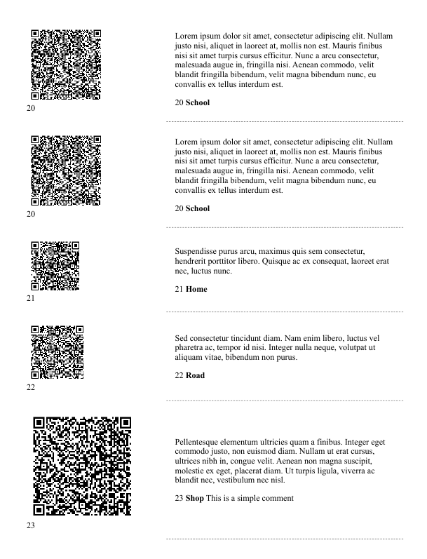

# batch-qrcode-paginator
Script for batch qrcode generation and pagination.

I wrote this small piece of software for Larps where I use qrcodes to provide secret or hidden information to
a subset of players.

From organizer point of view, I need a easy to read and cut pages 
with qrcodes, original text and unique codes for later reference.
Thus we can cut qrcodes and add them to interesting objects or places
and the original text will always be available for later reference whenever is required.

Furthermore I include also a simple line telling where the qrcode MUST be placed,
useful to delegate the repetitive task to a collaborator.

# Features

- [x] Read input data from google drive
- [x] Convert every line in a qcode
- [x] Generate an html page
- [x] Export html page to printable pdf
- [x] Output pagination includes, the qrcode, unique references, original text, additional informative text for the staff
- [x] Upload result to a google drive folder

# How to

This is a python script, just create the virtual environment and install requirements

```
pip install -r requirements.txt
```

and run it with python

```
python3 ./build_qrcodes.py
```

configuration file is `./config.yaml`

# input 

Input should be a table with the following named columns

| content     | size | count | id | where  | comments |
|-------------|------|-------|----|--------|----------|
| Lorem Ipsum | 5    | 2     | 1  | School |          |

where:
- `content` is the actual encoded content,
- `size` is the scale of the qrcode, if not specified default is `5`,
- `count` is the number of repetition of the same qrcode, if not specified default is `1`,
- `id` is a unique identifier, useful to track the qrcode after it was removed from the page, if not specified a default incremental id is used,
- `where` is where the qrcode must be placed,
- `comments` are additional comments to print on the right of id and position.

Do not leave empty lines, the script stops at the first empty content.

# output

Output is saved locally and eventually uploaded to a gdrive folder (See below).
It is a single pdf file with ALL qrcodes with id, content, where and comments fields.

e.g.



# gdrive integration

To download input data from google drive, add `credentials.json` file to the directory and update
config.yaml accordingly, e.g.

```
input:
  gdrive:
    download: true
    url: "https://docs.google.com/spreadsheets/d/1Abh8CELvHY5cvGf8fR0uOAf3sJX2bf1_Pi4Iv9ch1p4/edit?gid=0"
    credentials: "./credentials.json"
    access_token: "./user_creds.txt"
```

if you want to upload, e.g.

```
output:
  gdrive:
    upload: true
    folder: "2bbNjG2w_XLEhkrH6e1rClzOfhU5SzntY"
```

You can obtain a valid `credentials.json` from google cloud > APIs & services > Credentials > OAuth 2.0 Client IDs


